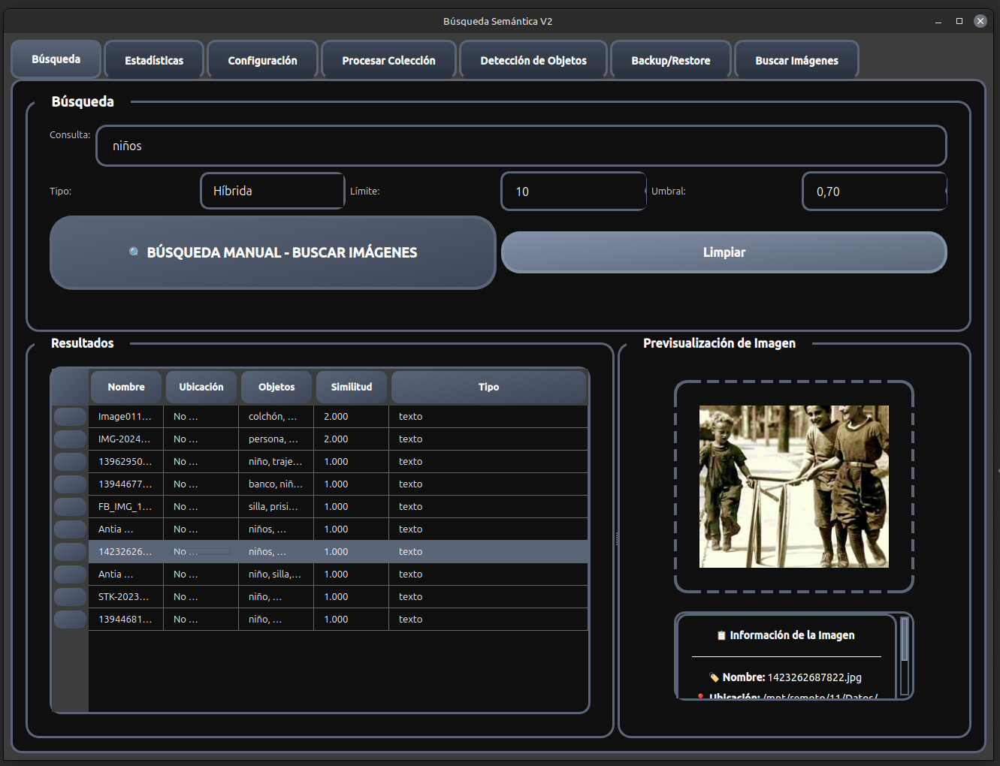
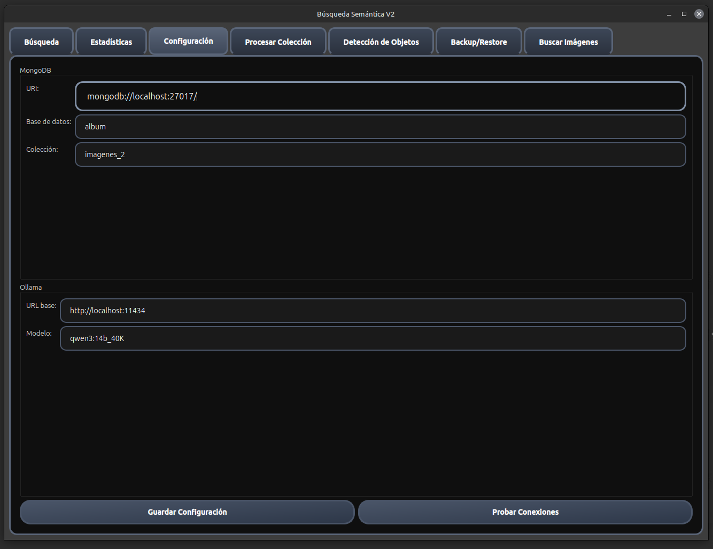
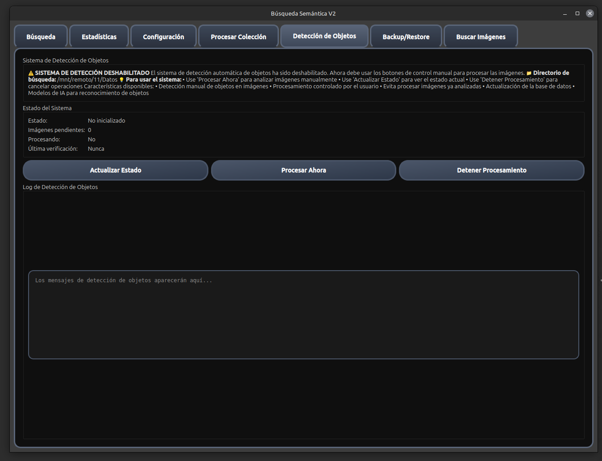
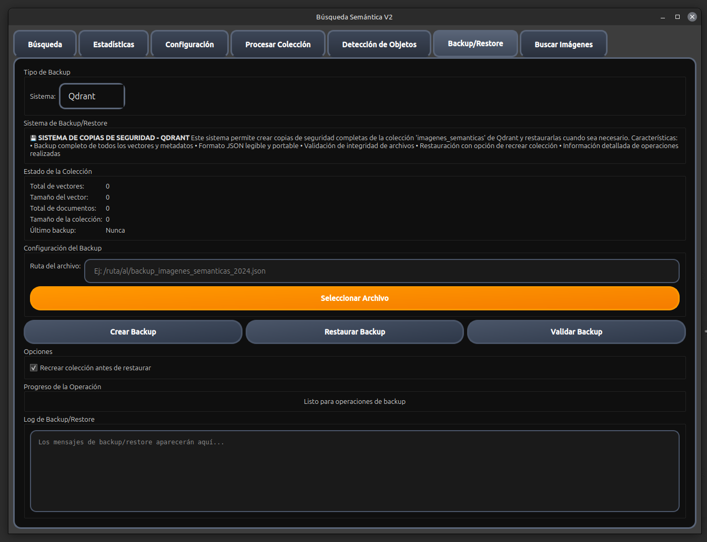
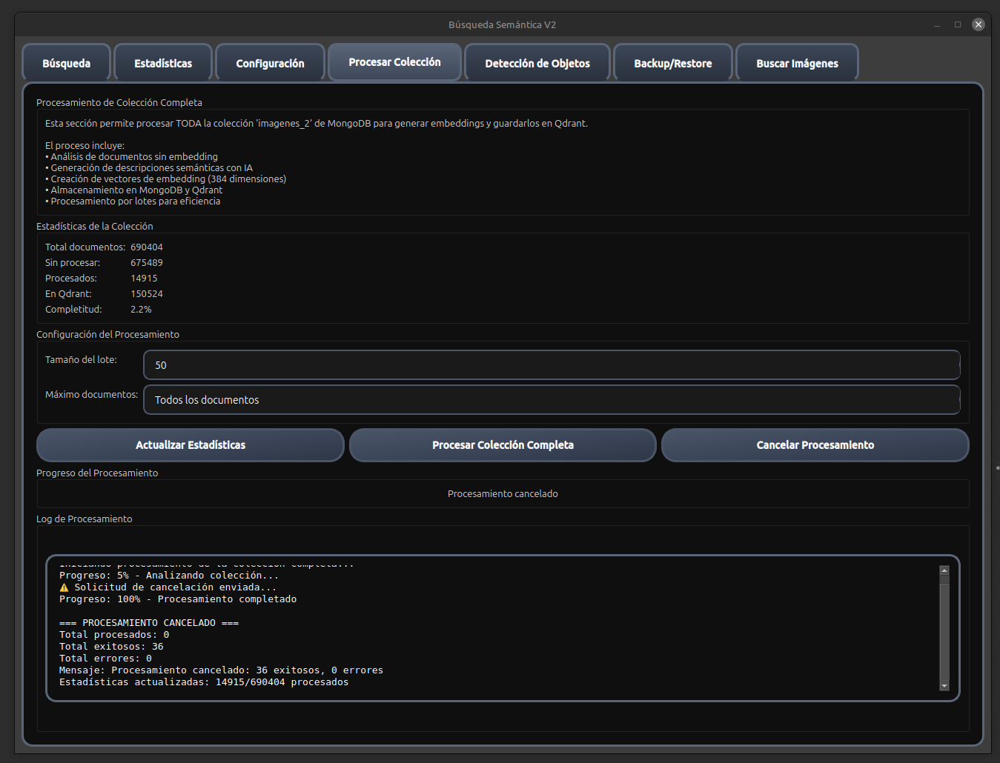
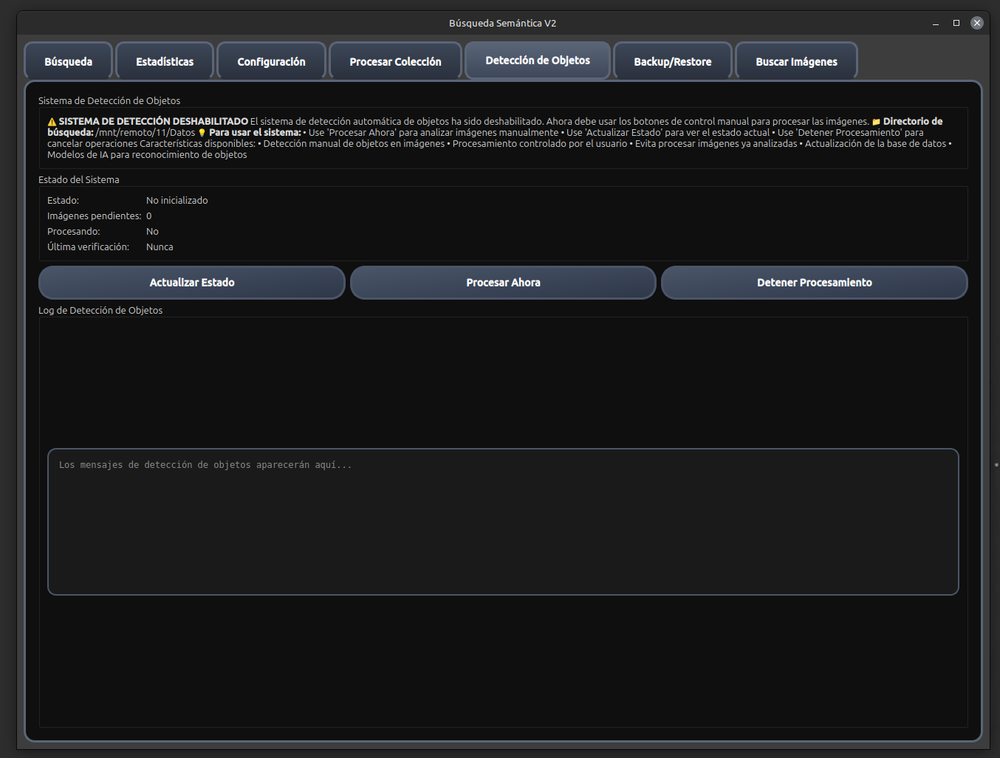

# 🔍 Búsqueda Semántica V2

[](https://www.python.org/downloads/)
[](https://www.mongodb.com/)
[](https://qdrant.tech/)
[](https://www.qt.io/qt-for-python)
[](https://www.langchain.com/)
[](https://ollama.ai/)
[](https://opensource.org/licenses/MIT)

> Sistema avanzado de búsqueda semántica con IA para imágenes y documentos, combinando MongoDB, Qdrant y modelos de lenguaje de última generación.

## ✨ Características Principales

### 🚀 Búsqueda Inteligente
- **Búsqueda semántica** con embeddings vectoriales usando Ollama
- **Búsqueda híbrida** combinando texto y similitud semántica
- **Búsqueda por similitud** con cálculo de similitud coseno
- **Sugerencias automáticas** basadas en contenido existente

### 🖼️ Procesamiento de Imágenes
- **Detección automática de objetos** en imágenes
- **Extracción de metadatos** (EXIF, ubicación, fecha, etc.)
- **Análisis de contenido** con IA para generar descripciones
- **Procesamiento por lotes** para grandes volúmenes de datos

### 💾 Bases de Datos Híbridas
- **MongoDB** para almacenamiento principal de documentos
- **Qdrant** para búsquedas vectoriales optimizadas
- **Sincronización automática** entre ambas bases de datos
- **Escalabilidad** para millones de documentos

### 🖥️ Interfaz Gráfica
- **Aplicación de escritorio** moderna con PySide6
- **Interfaz intuitiva** para búsquedas y gestión
- **Monitoreo en tiempo real** del procesamiento
- **Estadísticas detalladas** del sistema

## 🛠️ Requisitos del Sistema

### Software Requerido
- **Python 3.8+**
- **MongoDB 4.4+**
- **Qdrant 1.0+**
- **Ollama** con modelos instalados

### Hardware Recomendado
- **CPU**: Multi-core (4+ núcleos)
- **RAM**: 8GB mínimo, 16GB recomendado
- **GPU**: Opcional (para aceleración de modelos)

## 🚀 Instalación Rápida

### 1. Clonar el Repositorio
```bash
git clone https://github.com/tu-usuario/busqueda-semantica-v2.git
cd busqueda-semantica-v2
```

### 2. Crear Entorno Virtual
```bash
# Usando conda (recomendado)
conda create -n busqueda_semantica_v2 python=3.9
conda activate busqueda_semantica_v2

# O usando venv
python -m venv venv
source venv/bin/activate  # Linux/Mac
# venv\Scripts\activate   # Windows
```

### 3. Instalar Dependencias
```bash
pip install -r requirements.txt
```

### 4. Configurar Variables de Entorno
```bash
# Copiar archivo de configuración
cp config/.env.example config/.env

# Editar configuración según tu entorno
nano config/.env
```

### 5. Iniciar Servicios
```bash
# Iniciar MongoDB
sudo systemctl start mongod

# Iniciar Qdrant
docker run -p 6333:6333 qdrant/qdrant

# Iniciar Ollama
ollama serve
```

### 6. Ejecutar la Aplicación
```bash
python main.py
```

## ⚙️ Configuración

### Variables de Entorno
```env
# MongoDB
MONGODB_URI=mongodb://localhost:27017/
MONGODB_DATABASE=album
MONGODB_COLLECTION=imagenes_2

# Qdrant
QDRANT_URL=http://localhost:6333
QDRANT_API_KEY=
QDRANT_COLLECTION=imagenes_semanticas

# Ollama
OLLAMA_BASE_URL=http://localhost:11434
OLLAMA_MODEL=qwen3:14b_40K
EMBEDDING_MODEL=embeddinggemma

# Aplicación
LOG_LEVEL=INFO
BATCH_SIZE=50
MAX_WORKERS=4
```

### Modelos de Ollama Requeridos
```bash
# Instalar modelos necesarios
ollama pull qwen3:14b_40K
ollama pull embeddinggemma
```

## 📖 Uso

### Interfaz Gráfica

1. **Iniciar la aplicación**:
   ```bash
   python main.py
   ```

2. **Procesar imágenes**:
   - Ir a la pestaña "Procesar Colección"
   - Configurar parámetros de procesamiento
   - Hacer clic en "Procesar Colección Completa"

3. **Realizar búsquedas**:
   - Ir a la pestaña "Búsqueda"
   - Escribir consulta de búsqueda
   - Seleccionar tipo de búsqueda (texto, semántica, híbrida)
   - Ver resultados ordenados por relevancia

### Línea de Comandos

#### Procesamiento por Lotes
```bash
# Procesar toda la colección
python procesar_coleccion.py --batch-size 50 --verbose

# Procesar máximo 1000 documentos
python procesar_coleccion.py --max-docs 1000 --batch-size 25

# Procesamiento silencioso
python procesar_coleccion.py --batch-size 100
```

#### Búsqueda Directa
```bash
# Búsqueda semántica
python -c "
from src.busqueda_semantica import BuscadorSemantico
from src.database import DatabaseManager

db = DatabaseManager()
buscador = BuscadorSemantico(db)
resultados = buscador.buscar_semanticamente('perros jugando en el parque')
for r in resultados:
    print(f'{r.documento.nombre}: {r.similitud:.3f}')
"
```

## 📸 Capturas de Pantalla

### Interfaz Principal
<div align="center">
  
  <p><em>Ventana principal con pestañas de navegación</em></p>
</div>

### Procesamiento de Colección
<div align="center">
  
  <p><em>Procesamiento por lotes con estadísticas en tiempo real</em></p>
</div>

### Búsqueda Semántica
<div align="center">
  
  <p><em>Interfaz de búsqueda con filtros y resultados</em></p>
</div>

### Configuración del Sistema
<div align="center">
  
  <p><em>Configuración de parámetros y conexiones</em></p>
</div>

### Monitoreo y Logs
<div align="center">
  
  <p><em>Seguimiento de procesos y logs del sistema</em></p>
</div>

### Resultados de Búsqueda
<div align="center">
  
  <p><em>Visualización de resultados con similitud y metadatos</em></p>
</div>

## 🏗️ Arquitectura del Sistema

```
┌─────────────────┐    ┌──────────────────┐    ┌─────────────────┐
│   MongoDB       │    │   Ollama         │    │   Qdrant        │
│                 │    │                  │    │                 │
│ • Documentos    │◄──►│ • Generar        │◄──►│ • Vectores      │
│ • Metadatos     │    │   descripciones  │    │ • Índices       │
│ • Embeddings    │    │   semánticas     │    │ • Búsquedas     │
└─────────────────┘    └──────────────────┘    └─────────────────┘
         │                       │                       │
         └───────────────────────┼───────────────────────┘
                                 │
                    ┌──────────────────┐
                    │   Aplicación     │
                    │                  │
                    │ • Interfaz GUI   │
                    │ • Procesamiento  │
                    │ • Búsquedas      │
                    └──────────────────┘
```

### Componentes Principales

- **`main.py`**: Punto de entrada de la aplicación
- **`src/busqueda_semantica.py`**: Motor de búsqueda semántica
- **`src/database.py`**: Gestor de MongoDB
- **`src/qdrant_manager.py`**: Gestor de Qdrant
- **`src/object_detector.py`**: Detección de objetos en imágenes
- **`src/metadata_extractor.py`**: Extracción de metadatos
- **`ui/main_window.py`**: Interfaz gráfica principal

## 📊 Rendimiento

### Métricas de Rendimiento
- **Búsquedas semánticas**: Hasta 100x más rápidas con Qdrant
- **Procesamiento por lotes**: Optimizado para grandes volúmenes
- **Escalabilidad**: Crece horizontalmente según necesidades
- **Precisión**: Mantiene alta calidad en resultados

### Optimizaciones Implementadas
- **Indexación vectorial** en Qdrant para búsquedas rápidas
- **Procesamiento asíncrono** para mejor rendimiento
- **Cache inteligente** de embeddings
- **Compresión de datos** para almacenamiento eficiente

## 🔧 Mantenimiento

### Backup y Restauración
```bash
# Backup de MongoDB
python test_backup_restore_mongodb.py

# Backup de Qdrant
python test_backup_restore.py
```

### Monitoreo del Sistema
```bash
# Ver estado del sistema
python status.py

# Verificar integridad de datos
python check_imports.py
```

### Limpieza de Datos
```bash
# Recrear colección de Qdrant
python recreate_qdrant_collection.py

# Limpiar datos duplicados
python setup_mongodb.py
```

## 🐛 Solución de Problemas

### Problemas Comunes

#### Qdrant no responde
```bash
# Verificar estado de Qdrant
curl http://localhost:6333/health

# Reiniciar Qdrant
docker restart qdrant
```

#### Error de conexión MongoDB
```bash
# Verificar MongoDB
mongosh --eval "db.adminCommand('ping')"

# Reiniciar MongoDB
sudo systemctl restart mongod
```

#### Error de memoria
```bash
# Reducir tamaño de lote
python procesar_coleccion.py --batch-size 10

# Procesar en lotes más pequeños
python procesar_coleccion.py --max-docs 100
```

### Logs y Debug
```bash
# Ver logs de la aplicación
tail -f busqueda_semantica.log

# Ejecutar en modo debug
LOG_LEVEL=DEBUG python main.py
```

## 🤝 Contribución

¡Las contribuciones son bienvenidas! Por favor, lee las [guías de contribución](CONTRIBUTING.md) antes de empezar.

### Pasos para Contribuir
1. Fork el proyecto
2. Crea una rama para tu feature (`git checkout -b feature/AmazingFeature`)
3. Commit tus cambios (`git commit -m 'Add some AmazingFeature'`)
4. Push a la rama (`git push origin feature/AmazingFeature`)
5. Abre un Pull Request

### Estándares de Código
- Sigue [PEP 8](https://www.python.org/dev/peps/pep-0008/) para estilo Python
- Escribe tests para nuevas funcionalidades
- Actualiza documentación cuando sea necesario
- Usa type hints en funciones nuevas

## 📝 Licencia

Este proyecto está bajo la Licencia MIT. Ver el archivo [LICENSE](LICENSE) para más detalles.

## 🙏 Créditos

- **LangChain** para el framework de procesamiento de lenguaje
- **Ollama** para los modelos de IA locales
- **Qdrant** para la base de datos vectorial
- **MongoDB** para el almacenamiento de documentos
- **PySide6** para la interfaz gráfica
- **Sentence Transformers** para los embeddings

## 📞 Soporte

Si encuentras algún problema o tienes preguntas:

1. Revisa la [documentación](#-documentación)
2. Busca en los [Issues existentes](https://github.com/tu-usuario/busqueda-semantica-v2/issues)
3. Crea un nuevo [Issue](https://github.com/tu-usuario/busqueda-semantica-v2/issues/new) con detalles del problema

## 📚 Documentación Adicional

- [Guía de Qdrant](README_QDRANT.md) - Integración detallada con Qdrant
- [API Reference](docs/API.md) - Documentación de la API
- [Deployment Guide](docs/DEPLOYMENT.md) - Guía de despliegue en producción

---

<div align="center">

**¡Convierte tus imágenes en conocimiento searchable con IA! 🧠📸**

[⭐ Star](https://github.com/tu-usuario/busqueda-semantica-v2) | [🐛 Reportar Bug](https://github.com/tu-usuario/busqueda-semantica-v2/issues) | [💬 Solicitar Feature](https://github.com/tu-usuario/busqueda-semantica-v2/issues)

</div>